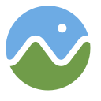

## 👋 Hi, I'm Joey Zhao

Web GIS & Frontend Engineer  
Focused on Cesium, OpenLayers, and data visualization platforms.

### 📊 GitHub Stats

  
  

### 👨‍💻 About Me

- 🔭 I’m currently working on a 3D GIS platform based on Cesium and OpenLayers
- 🌱 I’m currently learning Spring Boot and Docker  
- 👯 I’m looking to collaborate on Web GIS or data visualization projects
- 🤔 I’m looking for help with large-scale system architecture and performance optimization
- 💬 Ask me about Vue, Cesium, OpenLayers, and frontend engineering
- 📫 How to reach me: precious.joy@qq.com
- 😄 Pronouns: he/him
- ⚡ Fun fact: I enjoy building small tools that improve efficiency

### 🔧 Tech Stack

| Frontend | Backend | DevOps |
|--------|-------------| -----|
| 
 Vue.js   Cesium   OpenLayers
 | 
 Spring Boot   Node.js
 | 
 Docker   Nginx
 |

### 🧩 Side Projects & Learning Demos

> A small collection of personal demos and practice projects.
> Most of them are lightweight experiments built during learning and exploration,
> focusing on tooling, frameworks, and practical problem-solving rather than polished products.

1. **[dayjs-playground](https://fireworks99.github.io/dayjs-playground/)**
   A playground for experimenting with Day.js features and date/time handling.

2. **[learn-vercel](https://learn-vercel-six.vercel.app/)**
   A simple demo project for practicing deployment workflows with Vercel.

3. **[netdisk](http://fireworks99.github.io/netdisk-web/)**
   Frontend part of a Spring Boot practice project, exploring basic file management and preview features.

4. **[SSMDocs](https://fireworks99.github.io/SSMDocs/)**
   Personal notes and summaries while learning the SSM (Spring + Spring MVC + MyBatis) stack.

5. **[LearnVuePress](https://fireworks99.github.io/LearnVuePress/)**
   A hands-on experiment with VuePress for documentation and static site generation.

6. **[GIS_Cesium_OpenLayers](https://fireworks99.github.io/GIS_Cesium_OpenLayers/)**
   Small GIS demos built with Cesium and OpenLayers, mainly for learning and feature exploration.
   
